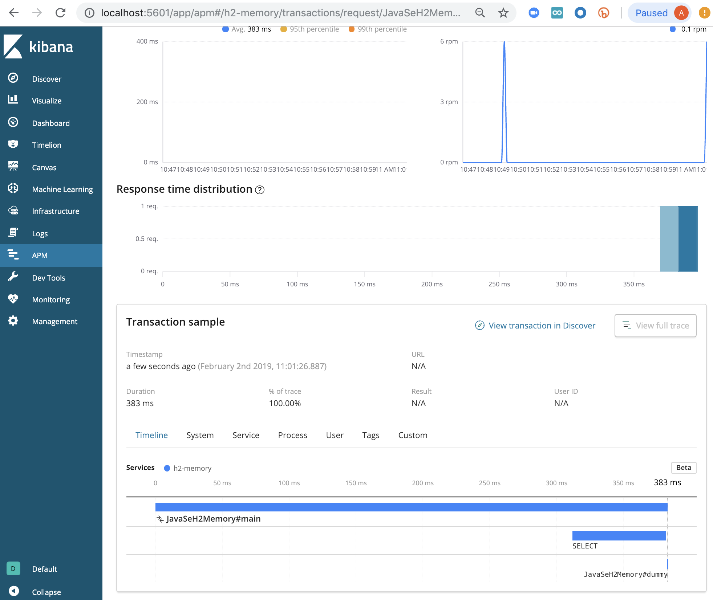

# Elastic APM

Show how annotation works. See https://www.elastic.co/guide/en/apm/agent/java/current/public-api.html#api-annotation

Using H2 database and a local installation of ElasticSearch and APM server.

Example Trace:
-----------------

